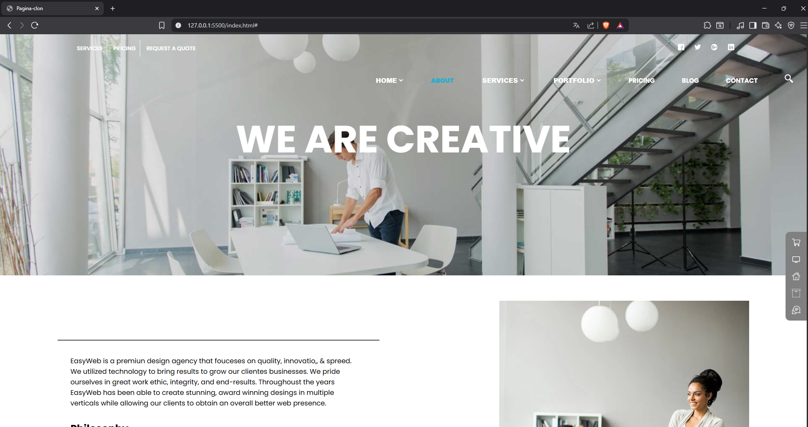

# TP3 – Clon con Flexbox

Este proyecto consiste en la **recreación de una interfaz web** utilizando tecnologías HTML5 y CSS3, haciendo foco en el uso de **Flexbox** para lograr una maquetación moderna.  
Es parte de un trabajo práctico del curso de desarrollo web full stack.

---

## GIT PAGES

🔗 [Ver proyecto en GitHub Pages](https://lautioliva.github.io/tp3-flexbox-clon/)  


---

## 📸 Captura del sitio



---

## 🛠️ Tecnologías utilizadas

- HTML5
- CSS3 (con Flexbox)
- Diseño responsive (Media Queries si corresponde)

---

## 📁 Estructura del proyecto

```
tp3-flexbox-clon/
│
├── index.html # Página principal
├── css/
│ └── style.css # Estilos del sitio con Flexbox
├── img/
│ ├── captura.png # Captura del sitio web
│ └── ... # Otras imágenes
└── README.md # Este archivo
```


---

## ✨ Funcionalidades

- Clon visual de un sitio dado como referencia
- Uso correcto de etiquetas semánticas HTML
- Separación de estructura (HTML) y estilos (CSS)

---

## 🚀 Cómo visualizarlo localmente

Clonar el repositorio:
```bash
git clone https://github.com/LautiOliva/tp3-flexbox-clon.git
```